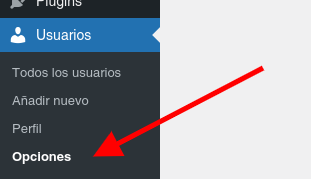
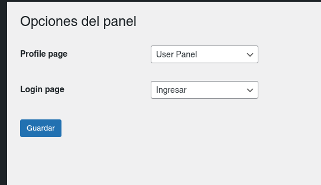

#USER PANEL

[Docs Español](#spa) || [Docs English](#eng)

### Docs Español

El plugin User Panel se creo como una extensión del plugin **[Subscriptions](https://genosha-tech.github.io/ta-suscripciones/).**

EL proposito del plugin es ser un extensión para funciones de usuario que no se puedan o no sea posible extender en el plugin de suscripciones.

* * *

### Instalación

Para instalar el plugin, primero debe clonarlo o descargarlo de este repositorio:

[https://github.com/matezito/ta-user-panel](https://github.com/matezito/ta-user-panel)

Clonar:

`git clone https://github.com/matezito/ta-user-panel.git`

Descargar: en la pestaña code boton code (verde) del repositorio, descargar desde **Download ZIP** como se muestra en la imagen:

Una vez clonado o descargado, se debe mover la carpeta **user-panel** al directorio  

**`wp-content/plugins`**

de su instalación de Wordpress.

**IMPORTANTE**  
Tenga en cuenta que la carpeta **user-panel-main** debe ser renombrada a **user-panel** (en caso de que al clonar o descomprimir la carpeta este nombrada de esta forma).

Una vez que se descomprime y renombra la carpeta, nos dirigimos a la lista de plugins, buscamos **User Panel** o **Panel de Usuario**(según su idioma) y lo activamos.  

Más información sobre manejo de plugins (en Inglés):**[Wordpress Codex Plugins](https://wordpress.org/support/article/managing-plugins/)**

### Configuración

Una vez activo el plugin, no dirigimos al menú **Usuarios** y al submenú **Opciones (Options)**  
  
Donde encontramos la siguiente pantalla de configuración:  
  

La pantalla que vemos nos permite configurar las opciones de páginas por defecto para el plugin.  
De esta páginas, la opción de **Profile Page o Página de perfil** es creada automáticamente cuando se activa el plugin por primera vez, la segunda opción **Login Page o Ingresar** es creada por el plugin de Suscripciones.  
En el caso de la página de **Ingresar** se usa como referencia para que usuarios logueados y no logueados puedan iniciar sesión. Esto también esta hecho de esta forma porque este plugin en particular es una extensión del plugin de Suscripciones, o sea, no es utilizable de forma individual.  
En el caso de la página de Perfil, muestra, por defecto, la edición de datos básicos del usuario.  
Se puede modificar el título y slug desde el menú **Páginas**. Esto no afecta el funcionamiento de la misma.

Esta es toda la configuración necesaria para este complemento.

### Docs English

