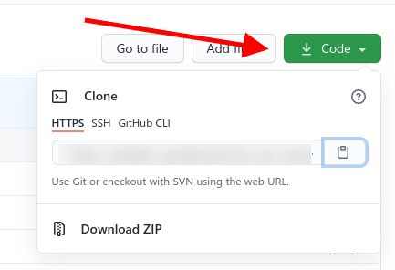
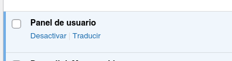

#USER PANEL

[Docs Español](#spa) || [Docs English](#eng)

### Docs Español

El plugin User Panel se creo como una extensión del plugin **[Subscriptions](https://genosha-tech.github.io/ta-suscripciones/).**

EL proposito del plugin es ser un extensión para funciones de usuario que no se puedan o no sea posible extender en el plugin de suscripciones.

* * *

### Instalación

Para instalar el plugin, primero debe clonarlo o descargarlo de este repositorio:

[https://github.com/matezito/ta-user-panel](https://github.com/matezito/ta-user-panel)

Clonar:

`git clone https://github.com/matezito/ta-user-panel.git`

Descargar: en la pestaña code boton code (verde) del repositorio, descargar desde **Download ZIP** como se muestra en la imagen:

Una vez clonado o descargado, se debe mover la carpeta **user-panel** al directorio  

**`wp-content/plugins`**

de su instalación de Wordpress.

**IMPORTANTE**  
Tenga en cuenta que la carpeta **user-panel-main** debe ser renombrada a **user-panel** (en caso de que al clonar o descomprimir la carpeta este nombrada de esta forma).

Una vez que se descomprime y renombra la carpeta, nos dirigimos a la lista de plugins, buscamos **User Panel** o **Panel de Usuario**(según su idioma) y lo activamos.  

Más información sobre manejo de plugins (en Inglés):**[Wordpress Codex Plugins](https://wordpress.org/support/article/managing-plugins/)**

### Docs English

